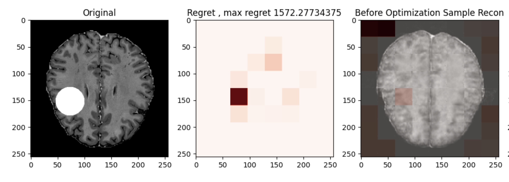

# MOOD 2023 - VIT-VAE outlier detection with Likelihood Regret

This repo is our training and docker code for the _Medical Out-of-Distribution Analysis Challenge_ at MICCAI 2023 [github repo](https://github.com/MIC-DKFZ/mood/tree/master).

Our approach adapted the Likelihood Regret code from [official repo](https://github.com/XavierXiao/Likelihood-Regret/tree/main) 

### Our VIT model perform posterior distribution learning per patch. The regret will be high If the patch contains outlier.



### Packages required


Install poetry and create our environment in the directory of pyproject.toml

```
poetry install
```

We suggest the following folder structure, to be placed in the same directory:

```
data/
--- brain/
------ brain_train/
------ toy/
------ toy_label/
--- abdom/
------ abdom_train/
------ toy/
------ toy_label/
```

For other datasets, refer to mood_dataloader.py LoadMOOD function to see the dataloader to prepare the dataset.

### Training VIT-VAE model

All files are stored under script/. Some files are requied for building docker, some are for training. 

Before training, if wandb logger will be used, fill in the wandb arguments in mood_train.py line 411-414, and use --wandb flag.

The main command in scripts/ to train:

```
cd scripts 
. train_mood.sh

```

To test or predict, use --test or --predict flag.

### Build Docker 
For GPU support you may need to install the NVIDIA Container Toolkit: <https://github.com/NVIDIA/nvidia-docker>
```
python run_example.py -i ../data/brain/ --no_gpu False
```

With `-i` you can pass an input folder (which has to contain a _toy_ and _toy_label_ directory) and with `--no_gpu` you can turn on/off GPU support for the docker (you may need to install the NVIDIA Container Toolkit for docker GPU support).

